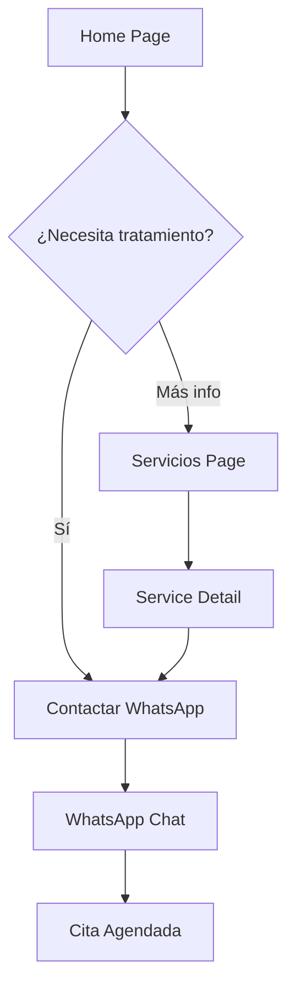
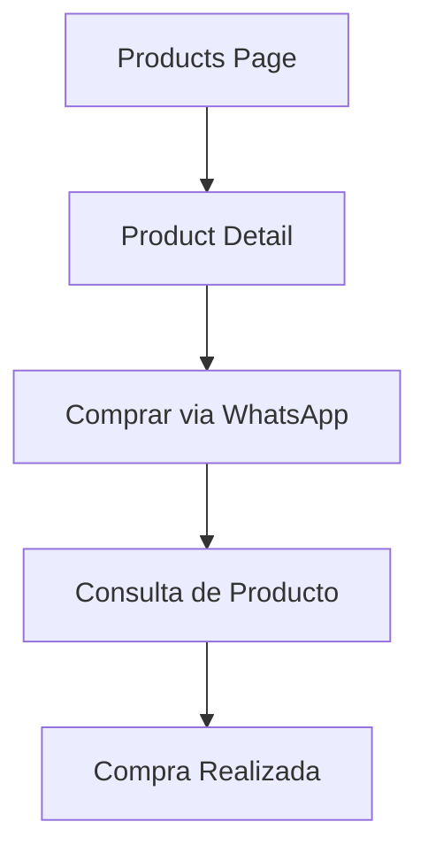

## 1. Product Overview

Sitio web profesional para Alfonso Alvira Yasno, terapeuta especializado en problemas de columna vertebral y cuerpo humano con 43 años de experiencia. El sitio transmite confianza médica y cercanía personal, combinando servicios terapéuticos con venta de productos naturales en Colombia.

- **Problema a resolver**: Pacientes con dolores de columna y lesiones corporales necesitan encontrar un terapeuta experto y confiable
- **Usuario objetivo**: Personas con problemas de columna, lesiones musculares, tendones, residentes en Colombia
- **Valor del producto**: Conectar pacientes con un terapeuta experimentado mediante presencia digital profesional y accesible

## 2. Core Features

### 2.1 User Roles

| Role | Registration Method | Core Permissions |
|------|---------------------|------------------|
| Visitor | No registration required | Browse all content, contact via WhatsApp, view products |
| Admin | Secure login | Manage testimonials, update services/products, view contact forms |

### 2.2 Feature Module

El sitio web consta de las siguientes páginas principales:

1. **Home page**: Hero section con CTA principal, navegación, resumen de servicios
2. **About page**: Información detallada del terapeuta, experiencia y enfoque
3. **Services page**: Grid de servicios especializados con descripciones
4. **Products page**: Catálogo de productos naturales con opciones de compra
5. **Contact page**: Formulario de contacto e información de WhatsApp

### 2.3 Page Details

| Page Name | Module Name | Feature description |
|-----------|-------------|---------------------|
| Home page | Hero section | Mostrar título principal "43 años devolviendo la movilidad", subtítulo descriptivo, botón WhatsApp prominente, botón secundario servicios. Imagen de fondo con silueta humana y columna destacada |
| Home page | Navigation header | Logo "Alfonso Alvira - Terapias Especializadas", menú: Inicio, Sobre Mí, Servicios, Productos, Testimonios, Contacto. Botón flotante WhatsApp fijo |
| Home page | Services preview | Grid de 6 servicios principales con iconos: Columna, Tronchaduras, Torceduras, Desgarres, Tendones, Cuajo. Diseño en 2 columnas responsive |
| Home page | Testimonials carousel | Carrusel automático de 3 testimonios con foto/iniciales, nombre, 5 estrellas, texto testimonio, tratamiento recibido |
| About page | Professional profile | Foto de Alfonso con sombrero vaquero, título "Tu terapeuta de confianza", texto de 43 años experiencia, iconos de confianza (años, pacientes, especialización) |
| About page | Experience section | Timeline visual de experiencia, metodología descriptiva, enfoque integral con productos naturales |
| Services page | Services grid | Grid completo de 7 servicios: Columna Vertebral, Tronchaduras, Torceduras, Desgarres Musculares, Problemas de Tendones, Lesiones y Lastimaduras, Terapia de Cuajo. Cada tarjeta con icono, nombre, descripción, botón "Más información" |
| Services page | Service detail modal | Modal que se abre al clickear "Más información" con descripción extendida del servicio, duración típica, beneficios |
| Products page | Products catalog | Grid de productos: Colágeno, Jarabes, Pomadas. Cada producto con imagen, nombre, descripción breve, botón "Comprar" que redirige a WhatsApp |
| Products page | Product benefits | Sección explicando beneficios de productos naturales, calidad y complemento a tratamientos |
| Contact page | Contact form | Formulario con campos: Nombre, Teléfono, Tipo de lesión, Mensaje. Validación en tiempo real, botón "Solicitar Información" |
| Contact page | WhatsApp CTA | Banner prominente con número +57 320 2168589, botón "Chatear ahora", horarios de atención, ubicación Colombia |
| Contact page | Social links | Links a Facebook e Instagram del profesional, integración con redes sociales |
| All pages | Footer | Verde oscuro con texto blanco, enlaces rápidos, copyright, aviso legal, logo repetido |

## 3. Core Process

### Flujo del Usuario Visitante

1. Usuario llega al Home page mediante búsqueda o referido
2. Visualiza Hero section con propuesta de valor de 43 años experiencia
3. Lee testimonios y servicios principales
4. Navega a Sobre Mí para conocer al terapeuta
5. Explora Servicios para entender tratamientos disponibles
6. Revisa Productos Naturales si está interesado en complementos
7. Usa Contacto o WhatsApp para agendar cita

### Flujo de Conversión Principal

### Flujo Secundario - Productos

## 4. User Interface Design

### 4.1 Design Style

**Colores principales:**
- Verde oscuro (#2E7D32): Headers, textos principales, footer
- Verde suave (#81C784): Elementos decorativos, hover states
- Blanco limpio (#FFFFFF): Fondos principales, espacios
- Crema suave (#F5F5DC): Secciones destacadas, alternativas de fondo

**Colores de acento:**
- Azul médico (#1976D2): Elementos de confianza, enlaces
- Naranja cálido (#FF8A65): Botones CTA principales
- Rosa suave (#F8BBD0): Toques personales, highlights

**Tipografía:**
- Headers: Playfair Display (Serif elegante, 32-48px)
- Body: Open Sans (Sans-serif limpia, 16-18px)
- Mínimo 16px para accesibilidad

**Estilo visual:**
- Botones redondeados (8-12px border-radius)
- Sombras sutiles (0 4px 6px rgba(0,0,0,0.1))
- Espaciado generoso (padding 24-32px)
- Iconos lineales profesionales en verde oscuro

### 4.2 Page Design Overview

| Page Name | Module Name | UI Elements |
|-----------|-------------|-------------|
| Home page | Hero section | Fondo con gradiente verde a blanco, silueta humana con columna iluminada, título 48px Playfair Display #2E7D32, subtítulo 20px Open Sans #424242, botón WhatsApp naranja #FF8A65 con icono, botón secundario outline verde |
| Home page | Navigation | Header fijo blanco con sombra, logo 24px Playfair Display #2E7D32, menú horizontal Open Sans 16px, hover verde suave, botón WhatsApp flotante verde fijo en esquina |
| Home page | Services grid | Grid 3x2 en desktop, 2x3 en tablet, 1x6 en móvil, tarjetas blancas con border-radius 12px, sombra suave, iconos 48px verde oscuro, título 20px, descripción 14px |
| Services page | Service cards | Tarjetas más grandes con imagen ilustrativa, badge de duración, lista de beneficios con checkmarks verdes, botón CTA prominente en cada tarjeta |
| Products page | Product grid | Layout similar a servicios pero con imágenes de productos reales, precio destacado, botón "Comprar por WhatsApp" naranja |
| Contact page | Form section | Formulario con inputs de 48px altura, bordes redondeados 8px, labels verde oscuro, validación en tiempo real con mensajes verde/rojo, botón submit naranja grande |
| Contact page | WhatsApp CTA | Banner destacado con gradiente verde, número grande blanco, icono WhatsApp animado, texto de urgencia "No dejes que el dolor te detenga" |

### 4.3 Responsiveness

- **Desktop-first approach**: Diseño optimizado para 1440px, adaptable hacia abajo
- **Breakpoints**: 1200px (desktop), 768px (tablet), 480px (móvil)
- **Mobile adaptations**: Menú hamburguesa, botones táctiles mínimo 44px, tipografía escalable
- **Touch optimization**: Swipe en carruseles, gestos de scroll suaves, botones grandes para dedos

### 4.4 Micro-interacciones

- **Scroll animations**: Fade in suave al aparecer elementos, duración 0.6s
- **Hover effects**: Botones cambian color (naranja a rojo suave), tarjetas elevan 4px
- **Loading states**: Skeleton screens para contenido dinámico, spinner minimalista
- **Transitions**: Todas las transiciones CSS con easing ease-out, duración 0.3s

## 5. Contenido Específico

### Textos Principales

**Hero Title**: "43 años devolviendo la movilidad y el bienestar a tu cuerpo"
**Hero Subtitle**: "Tratamientos especializados de columna y cuerpo con experiencia y dedicación"
**Sobre Mí**: "Con más de 43 años de experiencia en el tratamiento de problemas de columna y lesiones corporales, me dedico a devolver la salud y el bienestar a quienes sufren molestias físicas. Mi enfoque es integral, combinando técnicas tradicionales con productos naturales para ofrecer resultados duraderos."

**CTAs Principales**:
- "Contactar por WhatsApp +57 320 2168589"
- "Agenda tu primera consulta"
- "Chatear ahora"
- "Recupera tu movilidad hoy"

**Mensajes de Urgencia**:
- "No dejes que el dolor te detenga"
- "Tu bienestar es nuestra prioridad"
- "Recupera tu movilidad hoy"

### Testimonios de Ejemplo

1. **María García** - "Después de años con dolor de columna, Alfonso me devolvió la movilidad. Excelente trato y resultados inmediatos." - Tratamiento: Columna vertebral - ★★★★★

2. **Carlos Rodríguez** - "Profesionalismo y experiencia se notan desde la primera sesión. Recomendado 100%." - Tratamiento: Desgarre muscular - ★★★★★

3. **Ana Martínez** - "Los productos naturales complementaron perfectamente mi tratamiento. Calidad excepcional." - Tratamiento: Terapia de cuajo - ★★★★★

## 6. Requisitos Técnicos

### Performance
- Tiempo de carga < 3 segundos en 3G
- Optimización de imágenes (WebP, lazy loading)
- CSS y JS minificado
- Caché del navegador implementado

### SEO Local Colombia
- Meta tags geolocalizados
- Schema markup para negocio local
- Keywords: "terapeuta columna Colombia", "tratamiento dolor espalda", "terapias corporales"
- Sitemap XML dinámico

### Accesibilidad WCAG 2.1
- Contraste mínimo 4.5:1
- Navegación por teclado
- Alt text en todas las imágenes
- ARIA labels apropiados
- Tamaño de click mínimo 44x44px

### Integraciones
- WhatsApp Business API (wa.me/573202168589)
- Facebook pixel (si se requiere)
- Google Analytics 4
- Google Maps embed (ubicación)

### Seguridad
- HTTPS obligatorio
- Protección XSS
- Validación de formularios
- Rate limiting en formularios
- Política de privacidad compliant