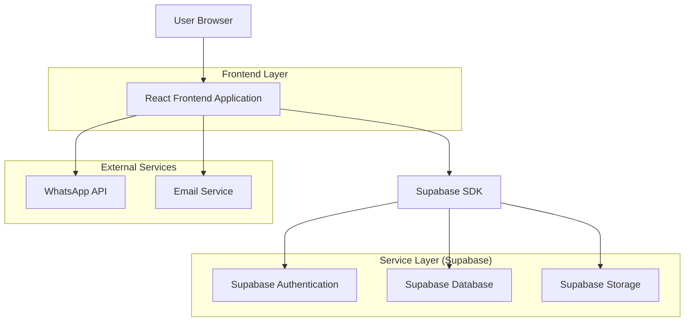
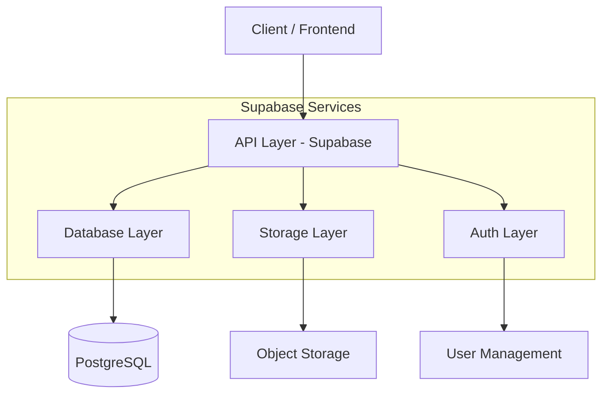
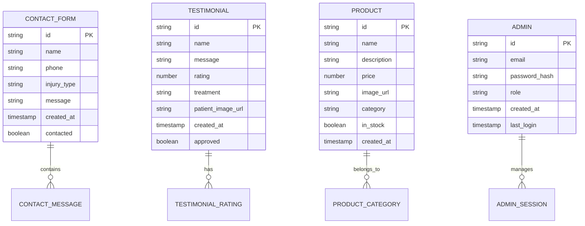

## 1. Architecture design



## 2. Technology Description

* **Frontend**: React\@18 + tailwindcss\@3 + vite

* **Initialization Tool**: vite-init

* **Backend**: Supabase (BaaS)

* **Database**: PostgreSQL (via Supabase)

* **Storage**: Supabase Storage para imágenes de productos

* **Authentication**: Supabase Auth para admin

* **Deployment**: Vercel/Netlify (frontend) + Supabase (backend)

## 3. Route definitions

| Route     | Purpose                                              |
| --------- | ---------------------------------------------------- |
| /         | Home page, hero section y servicios principales      |
| /about    | About page, información del terapeuta y experiencia  |
| /services | Services page, grid completo de tratamientos         |
| /products | Products page, catálogo de productos naturales       |
| /contact  | Contact page, formulario y WhatsApp CTA              |
| /admin    | Admin dashboard para gestionar contenido (protegido) |

## 4. API definitions

### 4.1 Contact Form API

```
POST /api/contact
```

Request:

| Param Name   | Param Type | isRequired | Description                    |
| ------------ | ---------- | ---------- | ------------------------------ |
| name         | string     | true       | Nombre completo del paciente   |
| phone        | string     | true       | Teléfono de contacto           |
| injury\_type | string     | true       | Tipo de lesión o problema      |
| message      | string     | false      | Mensaje adicional del paciente |

Response:

| Param Name  | Param Type | Description             |
| ----------- | ---------- | ----------------------- |
| success     | boolean    | Estado de la operación  |
| message     | string     | Mensaje de confirmación |
| contact\_id | string     | ID del registro creado  |

Example:

```json
{
  "name": "Juan Pérez",
  "phone": "+573001234567",
  "injury_type": "Dolor de columna",
  "message": "Tengo dolor lumbar hace 2 semanas"
}
```

### 4.2 Testimonials API

```
GET /api/testimonials
```

Response:

| Param Name   | Param Type | Description          |
| ------------ | ---------- | -------------------- |
| testimonials | array      | Lista de testimonios |
| total        | number     | Total de testimonios |

Testimonial Object:

| Param Name  | Param Type | Description                  |
| ----------- | ---------- | ---------------------------- |
| id          | string     | ID único del testimonio      |
| name        | string     | Nombre del paciente          |
| rating      | number     | Calificación (1-5 estrellas) |
| treatment   | string     | Tratamiento recibido         |
| message     | string     | Texto del testimonio         |
| created\_at | string     | Fecha de creación            |

### 4.3 Products API

```
GET /api/products
```

Response:

| Param Name | Param Type | Description            |
| ---------- | ---------- | ---------------------- |
| products   | array      | Lista de productos     |
| categories | array      | Categorías disponibles |

Product Object:

| Param Name  | Param Type | Description                |
| ----------- | ---------- | -------------------------- |
| id          | string     | ID único del producto      |
| name        | string     | Nombre del producto        |
| description | string     | Descripción breve          |
| price       | number     | Precio en COP              |
| image\_url  | string     | URL de imagen del producto |
| category    | string     | Categoría del producto     |
| in\_stock   | boolean    | Disponibilidad             |

## 5. Server architecture diagram



## 6. Data model

### 6.1 Data model definition



### 6.2 Data Definition Language

**Contact Forms Table (contact\_forms)**

```sql
-- create table
CREATE TABLE contact_forms (
    id UUID PRIMARY KEY DEFAULT gen_random_uuid(),
    name VARCHAR(255) NOT NULL,
    phone VARCHAR(50) NOT NULL,
    injury_type VARCHAR(255) NOT NULL,
    message TEXT,
    contacted BOOLEAN DEFAULT false,
    created_at TIMESTAMP WITH TIME ZONE DEFAULT NOW()
);

-- create indexes
CREATE INDEX idx_contact_forms_created_at ON contact_forms(created_at DESC);
CREATE INDEX idx_contact_forms_phone ON contact_forms(phone);

-- grant permissions
GRANT SELECT ON contact_forms TO anon;
GRANT ALL PRIVILEGES ON contact_forms TO authenticated;
```

**Testimonials Table (testimonials)**

```sql
-- create table
CREATE TABLE testimonials (
    id UUID PRIMARY KEY DEFAULT gen_random_uuid(),
    name VARCHAR(255) NOT NULL,
    message TEXT NOT NULL,
    rating INTEGER CHECK (rating >= 1 AND rating <= 5),
    treatment VARCHAR(255) NOT NULL,
    patient_image_url TEXT,
    approved BOOLEAN DEFAULT false,
    created_at TIMESTAMP WITH TIME ZONE DEFAULT NOW()
);

-- create indexes
CREATE INDEX idx_testimonials_approved ON testimonials(approved);
CREATE INDEX idx_testimonials_created_at ON testimonials(created_at DESC);
CREATE INDEX idx_testimonials_rating ON testimonials(rating DESC);

-- grant permissions
GRANT SELECT ON testimonials TO anon;
GRANT ALL PRIVILEGES ON testimonials TO authenticated;
```

**Products Table (products)**

```sql
-- create table
CREATE TABLE products (
    id UUID PRIMARY KEY DEFAULT gen_random_uuid(),
    name VARCHAR(255) NOT NULL,
    description TEXT NOT NULL,
    price INTEGER NOT NULL,
    image_url TEXT,
    category VARCHAR(100) NOT NULL,
    in_stock BOOLEAN DEFAULT true,
    created_at TIMESTAMP WITH TIME ZONE DEFAULT NOW(),
    updated_at TIMESTAMP WITH TIME ZONE DEFAULT NOW()
);

-- create indexes
CREATE INDEX idx_products_category ON products(category);
CREATE INDEX idx_products_in_stock ON products(in_stock);
CREATE INDEX idx_products_created_at ON products(created_at DESC);

-- grant permissions
GRANT SELECT ON products TO anon;
GRANT ALL PRIVILEGES ON products TO authenticated;

-- insert sample products
INSERT INTO products (name, description, price, category, in_stock) VALUES
('Colágeno Marino', 'Suplemento natural para la salud articular y de la piel', 85000, 'colagenos', true),
('Jarabe Multivitamínico', 'Jarabe natural con vitaminas esenciales para el bienestar', 45000, 'jarabes', true),
('Pomada Terapéutica', 'Pomada natural para aliviar dolores musculares y articulares', 35000, 'pomadas', true);
```

**Admin Users Table (admin\_users)**

```sql
-- create table
CREATE TABLE admin_users (
    id UUID PRIMARY KEY DEFAULT gen_random_uuid(),
    email VARCHAR(255) UNIQUE NOT NULL,
    password_hash VARCHAR(255) NOT NULL,
    role VARCHAR(50) DEFAULT 'admin',
    created_at TIMESTAMP WITH TIME ZONE DEFAULT NOW(),
    last_login TIMESTAMP WITH TIME ZONE
);

-- create indexes
CREATE INDEX idx_admin_users_email ON admin_users(email);
CREATE INDEX idx_admin_users_role ON admin_users(role);

-- grant permissions (solo para authenticated)
GRANT ALL PRIVILEGES ON admin_users TO authenticated;
```

## 7. Component Architecture

### 7.1 React Components Structure

```
src/
├── components/
│   ├── common/
│   │   ├── Header.jsx
│   │   ├── Footer.jsx
│   │   ├── Button.jsx
│   │   └── WhatsAppFloat.jsx
│   ├── home/
│   │   ├── Hero.jsx
│   │   ├── ServicesPreview.jsx
│   │   └── Testimonials.jsx
│   ├── services/
│   │   ├── ServiceCard.jsx
│   │   └── ServiceDetail.jsx
│   ├── products/
│   │   ├── ProductCard.jsx
│   │   └── ProductGrid.jsx
│   └── contact/
│       ├── ContactForm.jsx
│       └── WhatsAppCTA.jsx
├── pages/
│   ├── Home.jsx
│   ├── About.jsx
│   ├── Services.jsx
│   ├── Products.jsx
│   └── Contact.jsx
├── hooks/
│   ├── useContactForm.js
│   ├── useTestimonials.js
│   └── useProducts.js
└── utils/
    ├── supabase.js
    └── whatsapp.js
```

### 7.2 State Management

* **Local State**: React useState para formularios y UI interactions

* **Server State**: React Query para datos de Supabase

* **Global UI**: Context API para tema y navegación

## 8. Security Implementation

### 8.1 Frontend Security

* Input validation en formularios

* XSS protection con React

* HTTPS enforcement

* Content Security Policy headers

### 8.2 Backend Security (Supabase)

* Row Level Security (RLS) policies

* API rate limiting

* JWT token validation

* SQL injection prevention via prepared statements

### 8.3 Data Protection

* Phone numbers sanitization

* GDPR compliance para formularios

* Secure storage de imágenes

* Backup automático de base de datos

## 9. Performance Optimization

### 9.1 Frontend Optimization

* Code splitting por rutas

* Lazy loading de imágenes

* Tailwind CSS purging

* Service worker para offline

### 9.2 Image Optimization

* WebP format con fallback

* Responsive images con srcset

* Supabase Image transformation

* CDN integration

### 9
